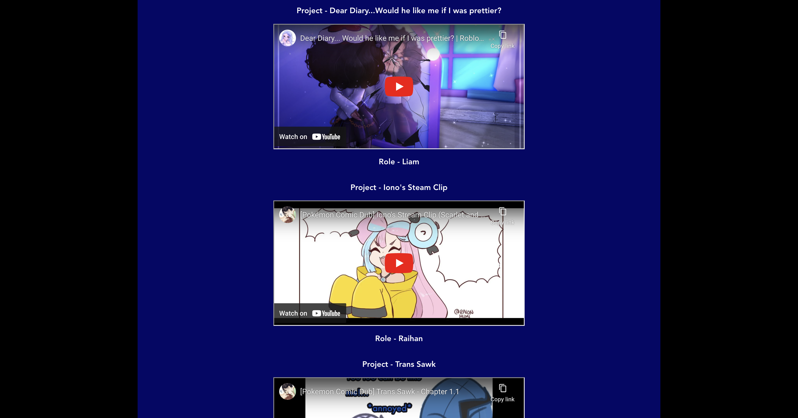

# Voice Actor Portfolio

## The Goal
A talented voice actor by the name of Marcelo Flores reached out to me to help him with a portfolio website.
I worked with Marcelo to come up with a design and functionality that he would be happy with while maintaining a user friendly interface.

## Tech Used
The project is built with *React*, *Typescript*, and *Css*. The site is responsive and uses
audio elements to display Marcelo's voice demos as well as youtube links for some of his previous works.

**Frontend**
- React
- Css
- Typescript

## ScreenShots

